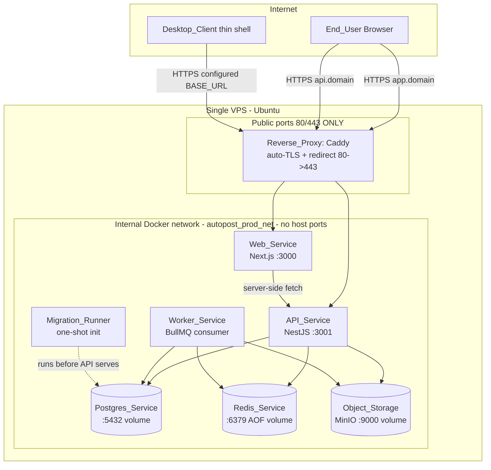
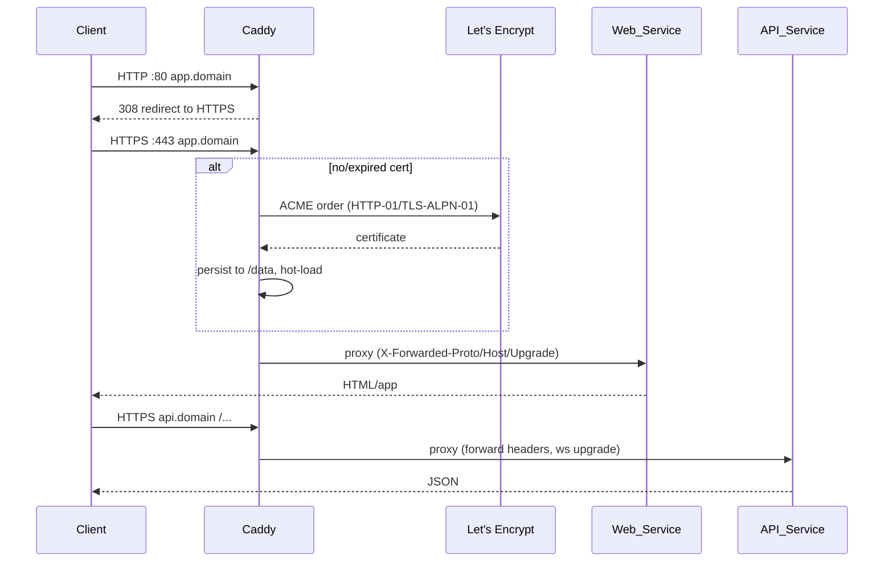
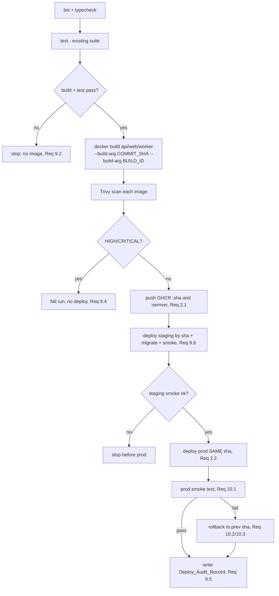

# Design Document: SaaS Production Deployment

## Overview

This design turns the existing "Izzi Auto Post" monorepo (`apps/api` NestJS 10 + Prisma/PostgreSQL + BullMQ, `apps/web` Next.js 14 App Router, `apps/worker` BullMQ consumer, `apps/desktop` Electron) into a hosted, multi-tenant commercial SaaS reachable over HTTPS on a real domain, deployed to a single VPS via Docker Compose, with automatic TLS, CI/CD on GitHub Actions, hosted object storage, observability, and backups.

The product rationale is timing: scheduled posts must fire at a future time regardless of whether any customer device is online. Therefore `API_Service`, `Worker_Service`, `Redis_Service`, `Postgres_Service`, and `Object_Storage` run server-side 24/7. The Electron `Desktop_Client` is demoted from a "local stack launcher" (it currently spawns `api`/`web`/`worker` from a monorepo checkout and probes ports 5432/6379/9000/3001/3005) to a thin shell that loads a configurable hosted URL.

### Scope and guiding decisions

This spec is **deployment and productionization**, not new product features. The following decisions are made up front and used consistently throughout the design (autonomous defaults per the request):

| Decision point | Choice | Documented alternative |
| --- | --- | --- |
| Reverse proxy / TLS | **Caddy** (automatic ACME, auto-recovery of expired certs, hot cert reload) | Nginx + Certbot (per existing `DEPLOYMENT.md`) |
| Image registry | **GHCR** (`ghcr.io/<org>/autopost-{api,web,worker}`) | Any OCI registry (Docker Hub, ECR) |
| Object storage | **Self-hosted MinIO** (S3-compatible, already in compose) | Cloudflare R2 / AWS S3 (same SDK, swap endpoint+creds) |
| Error monitoring | **Sentry-style sink** via `@sentry/node` | Any OTLP-compatible APM |
| Topology | **Single VPS**, all services on one internal Docker network | Documented scale-out path (managed PG/Redis, multi-node) |
| Image scanner | **Trivy** (fail on HIGH/CRITICAL) | Grype / Snyk |

### What already exists vs. what this design adds

| Concern | Current state (verified) | This design |
| --- | --- | --- |
| Compose | `docker-compose.yml` + `docker-compose.prod.yml` exist; **all data ports published to host** | Internal-only data services, add Caddy + migrate one-shot |
| TLS | Nginx+Certbot documented in `DEPLOYMENT.md` only | Caddy primary with persistent `/data`; Nginx alt documented |
| Health | `/health` and `/health/ready` exist; `ready()` returns `ready` **without checking deps** | Real readiness (PG+Redis+storage), add `/version` |
| Dockerfiles | Multi-stage but `node:18-alpine` (floating), **run as root**, no `HEALTHCHECK`, no SHA embed | Pinned digest, non-root, HEALTHCHECK, build-arg SHA/build id |
| CI | `ci.yml` lints/tests/builds; **no image build/scan/publish/deploy** | Build → test → Trivy → push by SHA+semver → staging → prod → smoke → rollback |
| Secrets | `CryptoService` throws on missing `ENCRYPTION_KEY` (recent fix); no central validation | `Config_Loader` fail-fast on all `Required_Config_Variable`s |
| Media | `/uploads` served from local disk; upload returns `http://localhost:PORT/uploads/...` | Object storage + streaming/signed URLs, no localhost |
| Observability | OTel SDK present with `ConsoleSpanExporter` only | Wire OTLP/Sentry exporter, JSON logs, metrics, alerts |
| Swagger / Bull Board | Swagger gated by `NODE_ENV`; Bull Board at `/admin/queues` (auth unverified) | Swagger off in prod, Bull Board behind auth |

### Requirements coverage map

| Requirement | Primary design section |
| --- | --- |
| 1 Reproducible hardened builds | Components → Container Images & Dockerfiles |
| 2 Same artifact promoted | Architecture → CI/CD; Components → CI/CD Pipeline |
| 3 24/7 worker + queue | Architecture → Runtime topology; Components → Worker_Service / Redis_Service |
| 4 Public HTTPS on real domain | Architecture → Network topology; Components → Reverse_Proxy |
| 5 Automatic TLS + expired recovery | Components → TLS_Manager (Caddy) |
| 6 Runtime secrets & config | Components → Config_Loader & Secrets |
| 7 Safe migrations on deploy | Components → Migration_Runner; Data Models → schema policy |
| 8 Health/readiness/version | Components → Health_Endpoints |
| 9 CI/CD build/test/scan/publish/deploy | Components → CI/CD Pipeline |
| 10 Smoke test + rollback | Components → Smoke_Test & Rollback |
| 11 Hosted object storage | Components → Object_Storage & media path |
| 12 Observability + deploy audit | Components → Observability |
| 13 Backups + restore | Components → Backup_Job & Restore_Procedure |
| 14 Zero-local-setup onboarding | Components → Web_Service & Desktop_Client |
| 15 Tenant isolation + security gate | Architecture → Security gate; Components → Security middleware |

## Architecture

### Runtime topology (single VPS)



Key invariants of the topology:
- **Only Caddy binds host ports (80/443).** `Postgres_Service`, `Redis_Service`, and `Object_Storage` expose **no** `ports:` mapping — they are reachable only on the internal `autopost_prod_net` network by service name (`postgres`, `redis`, `minio`). This satisfies Req 4.6 and is the single biggest change from the current `docker-compose.prod.yml`, which publishes 5432/6379/9000/9001 to the host.
- **Web and API are not directly published either**; Caddy reverse-proxies to them by service name (`web:3000`, `api:3001`).
- `Worker_Service` has no inbound ports at all; it only consumes from Redis and calls out to platforms.

### Request / TLS routing



### CI/CD promotion flow (same artifact, staging → prod)

```mermaid
graph LR
    PUSH[push to release branch] --> BT[Build + existing tests<br/>Req 9.1/9.2]
    BT -->|pass| IMG[Build images<br/>arg COMMIT_SHA+BUILD_ID<br/>Req 1.6/1.7]
    IMG --> SCAN[Trivy scan<br/>fail HIGH/CRITICAL<br/>Req 9.3/9.4]
    SCAN -->|pass| PUSHREG[Push GHCR<br/>tag :sha + :semver<br/>Req 2.1]
    PUSHREG --> STG[Deploy staging by SHA<br/>migrate deploy + smoke<br/>Req 9.6/10.1]
    STG -->|smoke ok| PROD[Deploy prod SAME SHA<br/>Req 2.2/2.4]
    PROD --> PSMOKE[Prod smoke test<br/>Req 10.1]
    PSMOKE -->|fail| RB[Rollback to prev SHA<br/>Req 10.2/10.3]
    PSMOKE -->|pass| AUDIT[Deploy_Audit_Record<br/>Req 9.5/12.6]
    RB --> AUDIT
```



The artifact built once (identified by commit SHA) is the one scanned, deployed to staging, smoke-tested, and then deployed to production **without rebuild** (Req 2.2). Environments differ only by injected runtime config/secrets (Req 2.3).

### Security gate (launch precondition)

`workspace-authorization` (the IDOR/Broken-Access-Control fix) is a **hard precondition** for public production launch (Req 15.1). This spec does not implement it; the CI/CD prod-deploy job gates on a launch-readiness check (a required status / manual environment approval in the GitHub `production` environment) that an Operator only enables once `workspace-authorization` is verified. Until then, production deploys are blocked or restricted to a private allowlist.

### Scale-out path (documented only, not built)

Single VPS first. When vertical scaling is exhausted: (1) move `Postgres_Service` to managed Postgres and `Redis_Service` to managed Redis; (2) move `Object_Storage` to R2/S3; (3) run multiple stateless `API_Service`/`Web_Service`/`Worker_Service` replicas behind the proxy; (4) replace Compose with an orchestrator. No code change is required for (1)/(2) because all of these are addressed by connection strings/endpoints from the `Secret_Source`.

## Components and Interfaces

### Reverse_Proxy (Caddy) — Req 4, Req 5

A single `caddy:<pinned-digest>` container terminates TLS and routes by hostname. A `Caddyfile` (mounted read-only) plus a persistent `/data` volume (ACME account + issued certs) and `/config` volume.

```caddyfile
# Caddyfile — app + api virtual hosts, automatic TLS
{
    email ops@example.com          # ACME account contact
    # on-demand off; explicit hosts below get certs at startup
}

app.example.com {
    encode gzip zstd
    reverse_proxy web:3000 {
        header_up X-Forwarded-Proto {scheme}
        header_up X-Forwarded-Host {host}
    }
}

api.example.com {
    encode gzip zstd
    reverse_proxy api:3001 {
        header_up X-Forwarded-Proto {scheme}
        header_up X-Forwarded-Host {host}
        # WebSocket/long-poll upgrades pass through automatically in Caddy
    }
}
# HTTP :80 -> HTTPS redirect is automatic in Caddy (Req 4.3)
```

Caddy behaviors that satisfy the requirements without extra code:
- **Req 5.1 obtain on first start**: named hosts trigger an ACME order at startup when no cert exists in `/data`.
- **Req 5.2 renew before expiry**: Caddy renews in the background (~30 days before expiry).
- **Req 5.3 expired-cert recovery**: because issuance/renewal is driven by Caddy's own maintenance loop (not an external cron that could be wedged), an already-expired cert is re-ordered automatically on the retry loop; HTTPS is restored with **no operator action**. This is the decisive reason Caddy is the primary choice.
- **Req 5.4 retry on failure**: Caddy retries ACME on a recurring backoff until success.
- **Req 5.5 hot reload**: new certs are loaded into the running listener without a manual restart.
- **Req 5.6 persistence**: certs + ACME account live on the `caddy_data` named volume, surviving container recreation.
- **Req 4.3 HTTP→HTTPS**, **Req 4.4 upgrades**, **Req 4.5 forwarded headers**: handled by the config above.

**Documented Nginx + Certbot alternative (Req 5, per `DEPLOYMENT.md`):** Nginx terminates TLS; `certbot renew` runs on a timer with a `deploy-hook` that reloads Nginx. Expired-cert recovery (Req 5.3) requires `certbot certonly --force-renewal` plus `nginx -s reload`; this is more moving parts (cron + hook) and is why it is the fallback, not the default.

API_Service must trust the proxy's forwarded headers so it builds correct external URLs (OAuth redirects, signed URLs). NestJS/Express: `app.set('trust proxy', 1)` — a minimal addition to `main.ts`.

### Container Images & Dockerfiles — Req 1

Each app gets a hardened multi-stage Dockerfile. Structured pseudocode for the API image (web/worker analogous; worker also installs `ffmpeg`):

```dockerfile
# syntax=docker/dockerfile:1
# ---- deps/build stage ----
FROM node:20-alpine@sha256:<pinned-digest> AS builder      # Req 1.3 pinned digest, not floating
WORKDIR /app
RUN npm install -g pnpm@9
# workspace manifests first for layer caching (Req 1.2 multi-stage)
COPY package.json pnpm-workspace.yaml pnpm-lock.yaml turbo.json tsconfig.json ./
COPY apps/api/package.json ./apps/api/
COPY packages/*/package.json ./packages/<each>/
RUN pnpm install --frozen-lockfile
COPY . .
WORKDIR /app/apps/api
RUN pnpm exec prisma generate --schema=./prisma/schema.prisma
WORKDIR /app
RUN pnpm --filter @auto-post/api build
# prune dev deps for runtime (Req 1.2 exclude dev deps)
RUN pnpm --filter @auto-post/api deploy --prod /app/pruned

# ---- runtime stage ----
FROM node:20-alpine@sha256:<pinned-digest> AS runner
WORKDIR /app
ENV NODE_ENV=production
# build metadata injected by CI (Req 1.7) — build args, NOT secrets
ARG COMMIT_SHA
ARG BUILD_ID
ENV APP_COMMIT_SHA=$COMMIT_SHA APP_BUILD_ID=$BUILD_ID
RUN apk add --no-cache curl                                 # for HEALTHCHECK
COPY --from=builder /app/pruned/node_modules ./node_modules
COPY --from=builder /app/apps/api/dist ./apps/api/dist
COPY --from=builder /app/apps/api/prisma ./apps/api/prisma
COPY --from=builder /app/apps/api/package.json ./apps/api/package.json
# non-root (Req 1.4): node image ships uid 1000 'node'
USER node
EXPOSE 3001
# container healthcheck hits a Health_Endpoint (Req 1.8)
HEALTHCHECK --interval=30s --timeout=5s --start-period=40s --retries=3 \
  CMD curl -fsS http://localhost:3001/health/live || exit 1
CMD ["node", "apps/api/dist/main.js"]
```

Hardening rules applied to all three images:
- **Req 1.3** every `FROM` pinned to a `@sha256:` digest (CI can update digests via a controlled bump, never `latest`).
- **Req 1.4** `USER node` before `CMD`; writable paths (none needed for api/web; worker uses `/tmp` for ffmpeg scratch) owned by `node`.
- **Req 1.5** no secret is ever a build arg or `COPY`ed file; only `COMMIT_SHA`/`BUILD_ID` (non-sensitive) are build args. `.dockerignore` excludes `.env`, `**/.env`, `node_modules`, `.git`.
- **Req 1.2** dev dependencies dropped via `pnpm deploy --prod` (or `pnpm prune --prod`); the runtime stage copies only pruned `node_modules` + build output (`dist`, `.next`).
- **Req 1.6** reproducibility: `--frozen-lockfile` + pinned digests + no timestamps baked into app output ⇒ same SHA builds produce equivalent application contents. (Bit-for-bit identity is out of scope; "application contents equivalent" is the target.)
- **Req 1.7** `APP_COMMIT_SHA` / `APP_BUILD_ID` env are read by the `/version` endpoint.
- **Req 1.8** `HEALTHCHECK` on api (`/health/live`) and web (`/` or a static health route).

Monorepo (pnpm + Turborepo) specifics: copy workspace manifests before source for cache reuse; `prisma generate` runs in the builder for api and worker; web copies `.next` + `public`; worker runtime stage `apk add ffmpeg`.

### Config_Loader & Secrets — Req 6

A startup validator that runs **before** the Nest app (or worker) begins listening, centralizing the fail-fast behavior that today exists only in `CryptoService` (which throws on missing `ENCRYPTION_KEY`).

```text
FUNCTION loadConfig(processEnv, role):           # role ∈ {api, worker}
    required ← REQUIRED_BY_ROLE[role]            # see table below
    missing ← [ name FOR name IN required IF isAbsentOrEmpty(processEnv[name]) ]
    IF missing not empty:
        log.error("Missing Required_Config_Variable(s): " + join(missing))   # names only, Req 6.2
        process.exit(1)                          # non-zero, do not start (Req 6.2)
    validateFormat(processEnv)                    # e.g. ENCRYPTION_KEY = 64 hex chars
    RETURN typedConfig                            # secrets held in memory only
```

| Required_Config_Variable | api | worker | Notes |
| --- | --- | --- | --- |
| `DATABASE_URL` | ✓ | ✓ | |
| `REDIS_HOST`, `REDIS_PORT` | ✓ | ✓ | |
| `ENCRYPTION_KEY` | ✓ | ✓ | already validated by CryptoService (64 hex) |
| `JWT_SECRET`, `JWT_REFRESH_SECRET` | ✓ | – | |
| `S3_ENDPOINT`, `S3_ACCESS_KEY`, `S3_SECRET_KEY`, `S3_BUCKET_NAME` | ✓ | ✓ | Object_Storage creds |
| OAuth client secrets (FB/Google/TikTok) | ✓ | ✓ | needed for refresh jobs |
| `CORS_ORIGINS`, public URLs | ✓ | – | production domains (Req 6.6) |

Secrets handling:
- **Req 6.1** all values read from `processEnv` at runtime, sourced from the VPS `.env` (root-owned, `chmod 600`, **not in git** — Req 6.7) loaded via Compose `env_file`. A secret manager (e.g. Doppler/SOPS/Vault) is a drop-in alternative that populates the same env.
- **Req 6.3 / 12.7** a redaction helper ensures startup config logging and structured logs print key names, never secret values or decrypted platform tokens.
- **Req 6.4** secrets go only to server-side services. The web client receives only `NEXT_PUBLIC_*` values, which are public by definition and MUST contain no secret. A CI guard greps the web client bundle for known secret names to enforce this (see Testing Strategy).
- **Req 6.5** production config is a separate `.env` on the VPS; development defaults (localhost URLs, `minioadmin`) are never used in prod.
- **Req 15.5** `ENCRYPTION_KEY` supplied at runtime drives the existing AES-256-GCM `CryptoService` for at-rest token encryption.

### Health_Endpoints — Req 8

Today `/health` returns liveness-ish data and `/health/ready` returns `ready` **without checking dependencies**. The design upgrades these and adds `/version`.

```text
GET /health/live            # Liveness (Req 8.1) — process up, no dependency checks
  -> 200 { status: "ok", uptime, timestamp }

GET /health/ready           # Readiness (Req 8.2, 8.3)
  checks ← [ pingPostgres(), pingRedis(), pingObjectStorage() ]   # each with short timeout
  IF all reachable -> 200 { status: "ready", checks: {postgres:"up", redis:"up", storage:"up"} }
  ELSE             -> 503 { status: "not_ready", checks: {... "down" ...} }   # 503 iff a required Data_Service is unreachable

GET /version                # Version_Info (Req 8.4)
  -> 200 { commit: APP_COMMIT_SHA, buildId: APP_BUILD_ID }
```

Minimal additions vs. existing: keep `/health` as an alias of `/health/live` for backward compatibility; make `/health/ready` actually probe `Postgres_Service` (Prisma `SELECT 1`), `Redis_Service` (`PING`), and `Object_Storage` (`HeadBucket`); add `/version`. The deployer uses `/health/ready` to gate traffic after deploy and the container `HEALTHCHECK` uses `/health/live` (Req 8.5).

### Migration_Runner — Req 7

Migrations run as a **one-shot init step** that must succeed before `API_Service` serves traffic, using the **same Promoted_Artifact image** (so the migration files match the code).

```text
deploy(sha):
    pull api:sha, web:sha, worker:sha          # Req 2.4 by SHA
    run one-shot:  api:sha  ->  prisma migrate deploy     # Req 7.1 before API serves
        IF exit != 0:  ABORT deploy, keep previous containers serving   # Req 7.3 / 7.5
    start/replace api, worker, web              # only after migrations succeed
```

In Compose this is a `migrate` service with `restart: "no"` that the deploy script runs and waits on (`docker compose run --rm migrate`) before recreating `api`. `prisma migrate deploy` is idempotent — already-applied steps leave the schema unchanged (Req 7.4).

Schema-change policy (Req 7.2, 7.6, and supports Req 10.4 rollback):
- **Forward-only, backward-compatible.** Every Migration_Step must be safe for the **previous** image to keep reading/writing while the new image rolls in.
- **Expand → migrate → contract.** Adding a column: make it nullable or give it a default (expand) in the release that needs it; never drop a column/table the previous image still uses. A removal is deferred to a later release **after** the prior image is retired (contract).
- This guarantees a Rollback to the prior image never requires a destructive schema change (Req 10.4).

### CI/CD Pipeline — Req 9, Req 2, Req 10

GitHub Actions, extending the existing `ci.yml` (which already lints/tests/builds). New jobs gate strictly:



Pipeline stage → requirement mapping:

| Stage | Requirement(s) |
| --- | --- |
| Run build + existing tests before any image | 9.1 |
| Stop on build/test failure, no publish/deploy | 9.2 |
| Trivy scan before publish | 9.3 |
| Fail on ≥ threshold (HIGH/CRITICAL) | 9.4 |
| Tag with commit SHA **and** semver | 2.1 |
| Deploy staging before prod | 9.6 |
| Deploy same artifact to prod, pull by SHA, no rebuild | 2.2, 2.3, 2.4 |
| Post-deploy smoke (login + scheduled post + live/ready/version) | 10.1 |
| Rollback on prod smoke failure | 10.2, 10.3 |
| Store Deploy_Audit_Record (commit/version/env/timestamp) | 9.5, 12.6 |

Deploy mechanism: an SSH step into the VPS runs `docker compose pull` (images already in GHCR, addressed by `:sha`) then the migrate one-shot then `docker compose up -d`. Staging and prod are two Compose project stacks (separate `.env`, separate domains) on the same or separate hosts; both consume the identical `:sha` images.

### Smoke_Test & Rollback — Req 10

```text
smokeTest(baseApiUrl, baseWebUrl):
    assert GET  {baseApiUrl}/health/live   == 200
    assert GET  {baseApiUrl}/health/ready  == 200          # deps reachable
    v ← GET {baseApiUrl}/version ; assert v.commit == EXPECTED_SHA   # right artifact live
    token ← POST {baseApiUrl}/auth/login (seeded smoke user) ; assert 200
    r ← POST {baseApiUrl}/posts (scheduled, future time, Bearer token) ; assert 2xx
    RETURN pass

rollback(env):                                              # Req 10.2/10.3
    prev ← lastSuccessful(Deploy_Audit_Record[env])
    retag/redeploy api,web,worker at prev.sha               # backward-compatible schema => safe (Req 10.4)
    wait until /version.commit == prev.sha AND /health/ready == 200
```

A documented manual rollback procedure mirrors the automated one for Operator use (Req 10.5) and is part of the incident playbook (Req 15.6). Smoke verifying `/version.commit == EXPECTED_SHA` is what enforces "the image running is the one we tested."

### Worker_Service & Redis_Service (24/7) — Req 3

- **Req 3.1 / 3.8** `Worker_Service` runs as a long-lived container consuming `Publish_Job` and `Sync_Job` (and token-refresh jobs) from Redis, independent of any client. It is the existing `apps/worker` BullMQ consumer.
- **Req 3.2** `restart: always` (or `unless-stopped`) on the worker service auto-restarts on crash/exit.
- **Req 3.3 / 3.4 / 3.5** BullMQ job options set `attempts` + `backoff`; on exhausting retries the job lands in the failed set (the `Dead_Letter_Store`) with its failure reason recorded. The processor must not swallow errors so BullMQ counts the attempt.
- **Req 3.6 / 3.7** `Redis_Service` runs with **AOF persistence** so queued jobs survive a restart. Change the current `--save 60 1` snapshot-only command to enable `appendonly`:

```yaml
redis:
  image: redis:7-alpine@sha256:<pinned>
  command: ["redis-server", "--appendonly", "yes", "--appendfsync", "everysec", "--save", "60", "1"]
  volumes: [ "redis_prod_data:/data" ]   # AOF + RDB persisted
  # no host ports (internal only)
```

### Object_Storage & media path — Req 11

Current code writes uploads to local disk (`/uploads`, served statically) and returns `http://localhost:PORT/uploads/...`. The production path moves media to `Object_Storage` (MinIO by default; R2/S3 by swapping endpoint+creds) accessed via the S3 SDK.

```text
upload(file, user):                              # replaces diskStorage
    key ← `${user.workspaceId}/${uuid()}-${safeName(file)}`     # tenant-scoped key
    putObject(bucket, key, file.stream, file.mimetype)          # to Object_Storage (Req 11.2 durable)
    RETURN { key }                                # store key in DB, NOT a localhost URL

serveMedia(key, user):                            # Req 11.3 — never local disk / localhost
    authorize(user, key)                          # workspace ownership check
    OPTION A: stream getObject(bucket,key) through API_Service
    OPTION B: presign getObject(bucket,key, expiresIn=CONFIG.signedUrlTtl)   # Req 11.4 expiry
              RETURN 302 -> Signed_URL
```

- **Req 11.1** API and worker both reach `Object_Storage` over the internal network (`http://minio:9000`) or the R2/S3 endpoint.
- **Req 11.5** endpoint + credentials come from the `Secret_Source` (`S3_ENDPOINT`, `S3_ACCESS_KEY`, `S3_SECRET_KEY`, `S3_BUCKET_NAME`), never dev defaults like `minioadmin`/localhost.
- Signed URLs are the default for read (offloads bytes from API); streaming through API is the fallback when stricter access control is needed. Either way the response references `Object_Storage`, not a client's disk.

### Observability — Req 12

- **Req 12.1** structured JSON logs for HTTP requests and job outcomes (e.g. `nestjs-pino` for api, a JSON logger in the worker), including request id, route, status, duration, job id, outcome.
- **Req 12.2** unhandled errors recorded to a Sentry-style sink (`@sentry/node` in api + worker; capture in a global exception filter and worker `failed` handler).
- **Req 12.3 / 12.4 / 12.5** metrics include application **error rate** and **Publish_Job failure count**; alert when error rate exceeds threshold over a window, and alert when any job is moved to the `Dead_Letter_Store`. OTel is already wired with a `ConsoleSpanExporter`; the design replaces it with an OTLP exporter (`OTLPTraceExporter` + metrics) pointed at a collector/APM, plus the Sentry sink for errors.
- **Req 12.6** the `Deploy_Audit_Record` (commit/version/env/timestamp) written by CI is queryable by the Operator (e.g. committed to a `deployments/` log, a GitHub deployment, or a `deploy_audit` table) so every running deploy traces to a commit.
- **Req 12.7** the log redaction helper (shared with Config_Loader) strips secrets and decrypted platform tokens from every log entry.

### Backup_Job & Restore_Procedure — Req 13

```text
daily 03:00 (cron container or host cron):
    pg_dump $DATABASE_URL | gzip > /backups/pg/autopost-$(date +%F).sql.gz     # Req 13.1
    mirror Object_Storage bucket -> /backups/media/ (or provider snapshot)      # Req 13.2
    prune backups older than RETENTION_DAYS (>=7)                               # Req 13.3
    IF any step fails: record failure + raise Alert                             # Req 13.6
```

- Backups stored off the primary data volume (separate volume and ideally off-host / to `Object_Storage` provider) so a disk loss doesn't take both.
- **Restore_Procedure (Req 13.4 / 13.5 / 13.7)** documented: stop API/worker → `gunzip | psql` into an empty `Postgres_Service` → restore media via `mc mirror` (or provider restore) → run `/health/ready` → resume. A periodic **restore drill** validates it (see Testing Strategy). This procedure is referenced by the incident playbook (Req 15.6).

### Web_Service & Desktop_Client (zero-local-setup) — Req 14

- **Req 14.1 / 14.2** `Web_Service` is served at the production web hostname through Caddy; an End_User just opens the URL — no Docker, no monorepo, no local service. Sign-up/login hits the hosted `API_Service` + `Data_Services`.
- **Req 14.5** because the worker/redis/postgres run server-side, scheduled publishing works with nothing on the user's device.
- **Req 14.3 / 14.4** `Desktop_Client` is rewritten from a local-stack launcher to a thin shell. Structured pseudocode:

```text
resolveBaseUrl():                                # Req 14.4 configurable
    RETURN  env IZZI_SERVER_URL
         ?? configFile.serverUrl                 # persisted after first-run prompt
         ?? firstRunPrompt("Enter your Izzi server URL")   # e.g. https://app.example.com
         ?? DEFAULT_HOSTED_URL

app.onReady():
    base ← resolveBaseUrl()
    mainWindow.loadURL(base)                      # load hosted web app, do NOT spawn api/web/worker
    # remove: port scanning (5432/6379/9000/3001/3005), spawn pnpm/node, local build checks
```

The current `main.js` port-probing + `startNodeService` + `resolveWorkspaceRoot` machinery is removed; the desktop client only loads the configured hosted URL. It stays **optional** (Req 14.3 "where offered").

### Security middleware — Req 15

- **Req 15.2** Helmet, CORS allowlist (prod domains), and Throttler rate-limiting enforced in production (already present in `main.ts`; CORS origins must be set to prod domains, Req 6.6).
- **Req 15.3** Swagger served only when `NODE_ENV !== 'production'` (already implemented) — keep off in prod.
- **Req 15.4** Bull Board (`/admin/queues`) placed behind authentication (an auth guard / basic-auth middleware) so it is not public in prod.
- **Req 15.5** at-rest secrets/tokens encrypted with AES-256-GCM via existing `CryptoService` + runtime `ENCRYPTION_KEY`.
- **Req 15.1 / 15.6** tenant-isolation gate enforced before public launch; incident playbook documents rollback + restore.

## Data Models

This is an infrastructure design; the "data model" is primarily the **persistence/volume model** and the **artifact/audit records**, not new application entities.

### Volume & network model (Compose)

```yaml
# docker-compose.prod.yml (structure)
networks:
  autopost_prod_net: { driver: bridge }     # single internal network

volumes:
  postgres_prod_data:    # Postgres_Service data        (Req 13 backed up)
  redis_prod_data:       # Redis AOF + RDB              (Req 3.6/3.7 durability)
  minio_prod_data:       # Object_Storage objects        (Req 11.2 durable)
  minio_prod_config:
  caddy_data:            # ACME account + TLS certs     (Req 5.6 cert persistence)
  caddy_config:

services:
  caddy:    # ONLY service with host ports 80/443; mounts Caddyfile + caddy_data/config
  web:      # internal :3000, no host port, depends_on api healthy
  api:      # internal :3001, no host port, env_file=.env, HEALTHCHECK, depends_on pg+redis healthy
  worker:   # no ports, restart: always, env_file=.env, depends_on pg+redis healthy
  migrate:  # one-shot (restart: "no"), api image, runs `prisma migrate deploy`
  postgres: # internal only (NO ports:), volume postgres_prod_data
  redis:    # internal only (NO ports:), appendonly yes, volume redis_prod_data
  minio:    # internal only (NO public ports:), volumes minio_prod_data/config
```

Differences from the current `docker-compose.prod.yml`: remove all `ports:` from `postgres`/`redis`/`minio`; add `caddy` + its volumes + `migrate` one-shot; switch redis to `appendonly yes`; add `healthcheck` + `depends_on: condition: service_healthy`; pin every image by digest; web/api no longer publish host ports (Caddy fronts them).

### Image tagging & promotion model

| Tag | Example | Purpose |
| --- | --- | --- |
| `:sha-<commitSHA>` | `ghcr.io/org/autopost-api:sha-9f3a1c2` | immutable, the Promoted_Artifact identity (Req 2.1/2.4) |
| `:<semver>` | `ghcr.io/org/autopost-api:1.4.0` | human-readable release (Req 2.1) |
| (no `latest` in deploy) | — | deploys always reference `:sha-…` |

### Version_Info (returned by `/version`)

```json
{ "commit": "9f3a1c2…", "buildId": "gh-run-1234567" }
```

### Deploy_Audit_Record — Req 9.5, Req 12.6

```json
{
  "deploymentRunId": "gh-run-1234567",
  "commitSha": "9f3a1c2…",
  "semver": "1.4.0",
  "environment": "production",
  "imageRefs": {
    "api": "ghcr.io/org/autopost-api:sha-9f3a1c2",
    "web": "ghcr.io/org/autopost-web:sha-9f3a1c2",
    "worker": "ghcr.io/org/autopost-worker:sha-9f3a1c2"
  },
  "result": "success",
  "timestamp": "2026-05-25T03:11:52Z"
}
```

### Media object model — Req 11

- DB stores an object **key** (e.g. `workspaceId/uuid-filename.ext`), never a localhost URL. Read access is via API streaming or a `Signed_URL` with a configured TTL. Keys are tenant-scoped to support the `workspace-authorization` ownership checks.

### Schema migration model — Req 7

- Prisma migrations live in `apps/api/prisma/migrations` (already present: `20260525031152_init`). `_prisma_migrations` table tracks applied steps (idempotency, Req 7.4). Policy is forward-only + backward-compatible (expand/contract), enforced by review and a migration dry-run check in CI.

## Correctness Properties

*A property is a characteristic or behavior that should hold true across all valid executions of a system — essentially, a formal statement about what the system should do. Properties serve as the bridge between human-readable specifications and machine-verifiable correctness guarantees.*

This is a deployment/infrastructure spec, so the **majority** of acceptance criteria are verified by integration tests (real proxy/registry/ACME/queue behavior) and smoke/config checks rather than property-based tests — those are listed in the Testing Strategy. The properties below are the genuine **universally-quantified invariants** worth validating across many inputs or configurations. Where an invariant is best validated by an integration harness (e.g. expired-TLS recovery), it is still stated here because the user asked for these invariants to be captured, and the property text defines the success condition the harness asserts. Each property has been consolidated to remove redundancy (see prework reflection).

### Property 1: Promoted artifact identity (staging == production)

*For any* single Deployment_Run, the image digest deployed to Production_Environment is identical to the image digest that was scanned and smoke-tested in Staging_Environment, for each of api/web/worker, with no rebuild in between.

**Validates: Requirements 2.2, 2.3**

### Property 2: Build → version round-trip

*For any* commit SHA `X` and build id `B` injected at build time, the running Application_Service reports `/version.commit == X` and `/version.buildId == B`; and building the same commit SHA twice yields equivalent application contents (`dist`/`.next`).

**Validates: Requirements 1.6, 1.7, 8.4**

### Property 3: No secret leaks across any non-secret surface

*For any* Secret_Value supplied to the Deployment_System, that value does not appear in: any Container_Image layer, history, or retained build arg; the Web_Service/Desktop_Client served content or built bundle (including `NEXT_PUBLIC_*`); the version-controlled repository; or any structured log entry (including decrypted platform tokens).

**Validates: Requirements 1.5, 6.3, 6.4, 6.7, 12.7**

### Property 4: Config fail-fast on missing required variable

*For any* non-empty subset of the Required_Config_Variables for a role, if those variables are absent or empty at startup, the Application_Service terminates with a non-zero exit and records the name(s) of every absent/empty variable (and never a secret value).

**Validates: Requirements 6.2**

### Property 5: Readiness reflects dependency reachability

*For any* combination of reachability states of the required Data_Services (Postgres_Service, Redis_Service, Object_Storage), the readiness Health_Endpoint returns 200 "ready" **iff** all required Data_Services are reachable, and returns HTTP 503 "not-ready" otherwise.

**Validates: Requirements 8.2, 8.3**

### Property 6: Scheduled post is attempted independent of any client

*For any* post scheduled at time `T`, once `T` has passed the Worker_Service processes the corresponding Publish_Job and attempts publication, regardless of whether any End_User device or local service is online.

**Validates: Requirements 3.3, 14.5**

### Property 7: Publish-job retry then dead-letter

*For any* Publish_Job that keeps failing, the Worker_Service retries it at most its configured maximum number of attempts using an increasing backoff delay, and if it exhausts those attempts the job is moved to the Dead_Letter_Store with its failure reason recorded.

**Validates: Requirements 3.4, 3.5**

### Property 8: Queue durability across Redis restart

*For any* set of Publish_Jobs and Sync_Jobs queued before a Redis_Service restart, those jobs are still present after the restart (on-disk persistence preserves queued work).

**Validates: Requirements 3.6, 3.7**

### Property 9: Token encryption round-trip

*For any* plaintext token, `decrypt(encrypt(plaintext)) == plaintext` under AES-256-GCM with the production `ENCRYPTION_KEY`, and the stored ciphertext is not equal to the plaintext.

**Validates: Requirements 15.5**

### Property 10: Migrations are backward-compatible, non-destructive, and idempotent

*For any* Migration_Step applied during a Deployment_Run, the step does not drop a column or table that the previously deployed Container_Image still reads or writes (so a Rollback to that prior image needs no destructive schema change); and applying an already-applied Migration_Step leaves the schema unchanged.

**Validates: Requirements 7.2, 7.4, 7.6, 10.4**

### Property 11: Served media never references local disk or localhost

*For any* uploaded media object served to an authenticated End_User, the returned reference is an API_Service route or a Signed_URL pointing at Object_Storage — never an End_User local disk path or a developer localhost address.

**Validates: Requirements 11.3**

### Property 12: Signed_URL expiry

*For any* Signed_URL issued for a media object, read access succeeds before the configured expiry duration and is denied after it.

**Validates: Requirements 11.4**

### Property 13: Backup retention boundary

*For any* set of backups with assorted ages, after the prune step every backup whose age is within the retention period (≥ 7 days) is retained and every backup older than the retention period is removed.

**Validates: Requirements 13.3**

### Property 14: Backup → restore round-trip

*For any* captured Postgres_Service state (and any captured Object_Storage media set), restoring its backup into an empty Postgres_Service (respectively into Object_Storage) reproduces the state captured in that backup.

**Validates: Requirements 13.4, 13.5**

### Property 15: Structured log validity

*For any* HTTP request or job-processing outcome, the emitted log entry is valid structured JSON containing the required fields (e.g. timestamp, level, request/job identifier, route/queue, outcome).

**Validates: Requirements 12.1**

### Property 16: HTTP → HTTPS redirect for all paths

*For any* request path requested over plain HTTP, the Reverse_Proxy responds with a redirect to the HTTPS equivalent of the same path.

**Validates: Requirements 4.3**

### Property 17: Production security enforcement

*For any* response served by API_Service in Production_Environment, the Helmet security headers are present; *for any* request from an origin not on the CORS allowlist, the cross-origin request is rejected; a burst of requests beyond the configured rate limit is throttled; and *for any* request to the queue dashboard (`/admin/queues`) without valid authentication, access is denied.

**Validates: Requirements 15.2, 15.4**

### Property 18: Build & topology hardening invariants

*For any* Dockerfile in the repository, every `FROM` reference is pinned to a digest or specific version (never `latest`), and every produced Container_Image runs as a non-root user; and *for any* Data_Service in the production Compose configuration, no host port is published (data services are internal-only).

**Validates: Requirements 1.3, 1.4, 4.6**

> Properties intentionally **not** written as PBT (handled by integration/smoke per Testing Strategy): TLS issuance/renewal/expired-recovery/persistence (5.1–5.6), proxy routing & header/upgrade forwarding (4.1, 4.2, 4.4, 4.5), pipeline ordering & gates (9.1, 9.3, 9.6, 9.2 negative path, 9.4 negative path), smoke critical path & rollback trigger (10.1, 10.2), error sink / metrics / alerts (12.2–12.5), onboarding flows (14.1–14.3), and process/doc gates (6.5, 6.6, 11.5, 13.7, 15.1, 15.3, 15.6). These either don't vary meaningfully with input, test external/infra behavior, or are one-time config/doc checks.

## Error Handling

The Deployment_System's error handling centers on four failure domains. Each defines detection, automatic response, operator-facing signal, and the invariant it preserves.

### Failed deploy (build/test/scan gate or staging smoke fails)

- **Detection:** CI job non-zero exit (build/test), Trivy reports ≥ HIGH/CRITICAL, or staging smoke fails.
- **Response:** Stop the Deployment_Run immediately; do **not** publish or deploy a Container_Image (Req 9.2, 9.4). Production is never touched. The currently-running prod artifact keeps serving.
- **Signal:** CI run marked failed; failure surfaced to the Operator; no Deploy_Audit_Record for a non-deployed image (or a record with `result: failed`).
- **Invariant preserved:** production only ever runs an artifact that passed build, tests, scan, and staging smoke.

### Failed migration

- **Detection:** the one-shot `prisma migrate deploy` step exits non-zero.
- **Response:** abort the deploy **before** replacing the running `API_Service`; the previous Container_Image keeps serving (Req 7.3, 7.5). Because migrations are forward-only and backward-compatible, the prior image remains schema-compatible.
- **Signal:** deploy fails with the migration error; Operator alerted.
- **Invariant preserved:** the database is never left half-migrated against a running new image; rollback needs no destructive change (Property 10).

### Failed TLS issuance/renewal (including expired cert)

- **Detection:** Caddy's ACME order fails or a cert is at/after expiry.
- **Response:** Caddy retries issuance on a recurring backoff until success (Req 5.4); on success it hot-loads the new cert with no restart (Req 5.5). An already-expired cert is re-ordered automatically by the same maintenance loop — **no operator action** (Req 5.3). Certs/ACME state persist on `caddy_data` so a container recreation does not lose progress (Req 5.6).
- **Signal:** Caddy logs the ACME failures; an alert can be wired on repeated failures, but recovery is automatic.
- **Fallback:** if ACME is persistently unreachable, the documented Nginx+Certbot path or manual `--force-renewal` is the operator escape hatch (Req 5, incident playbook 15.6).
- **Invariant preserved:** HTTPS is restored automatically without manual intervention (Property: expired-cert recovery, validated by integration).

### Failed backup

- **Detection:** any step of the Backup_Job (pg_dump, media mirror, prune) exits non-zero.
- **Response:** record the failure and raise an Alert (Req 13.6); retain existing valid backups (prune only removes backups older than retention, and only runs after a successful new backup where possible).
- **Signal:** Alert to Operator; failure recorded in backup log.
- **Invariant preserved:** a failed backup never silently passes and never deletes the last good backup.

### Cross-cutting

- **Startup misconfiguration:** `Config_Loader` fails fast with a non-zero exit naming the missing `Required_Config_Variable` (Req 6.2) — the service refuses to start half-configured.
- **Dependency outage at runtime:** `/health/ready` returns 503 (Property 5), so the proxy/deployer stops sending new traffic to an unready API; the liveness check keeps the process from being needlessly killed if only a dependency (not the process) is down.
- **Worker crash:** `restart: always` brings it back (Req 3.2); in-flight jobs remain in Redis (Property 8) and are reprocessed.
- **Prod smoke failure:** triggers automatic Rollback to the previous SHA (Req 10.2, 10.3); post-rollback `/version` confirms the prior artifact is live.

## Testing Strategy

A layered strategy: **property-based tests** for the universally-quantified invariants above, **integration tests** for infrastructure/external behavior, and **smoke/config checks** for one-time setup and docs. Per the spec's nature, integration tests carry most of the weight.

### Property-based tests

- Use a property library for the target language (TypeScript: **fast-check** with Jest/Vitest — do not hand-roll generators).
- Minimum **100 iterations** per property test.
- Each test tagged: `// Feature: saas-production-deployment, Property {n}: {property_text}`.
- Each correctness property is implemented by a **single** property-based test. Highest-value, lowest-cost properties to implement first (pure logic, mockable):
  - **Property 9 (crypto round-trip)** — pure function over `CryptoService`; trivial and high value.
  - **Property 5 (readiness 503 iff dep down)** — mock the three dependency pings; generate up/down subsets; assert 200 iff all up.
  - **Property 4 (config fail-fast)** — generate subsets of required vars to unset; assert non-zero exit + named var.
  - **Property 7 (retry then dead-letter)** — in-memory/mocked queue; generate failure counts; assert attempt cap, backoff growth, dead-letter + reason.
  - **Property 12 (signed-url expiry)** — generate TTLs and access times; assert allow-before / deny-after.
  - **Property 13 (backup retention)** — generate backup ages; assert kept iff within retention.
  - **Property 11 (media reference)** — generate uploads; assert returned reference matches API/Signed_URL host, never localhost/disk.
  - **Property 16 (HTTP→HTTPS)** and **Property 18 (Dockerfile/topology static checks)** — generate paths / parse all Dockerfiles + compose; assert pinned, non-root, no public data ports.
- Properties best realized as harness assertions (still 1 assertion of the invariant, run in CI/integration rather than 100× randomized): **Property 1** (digest equality staging vs prod), **Property 2** (build→version), **Property 3** (secret-leak scan over layers/bundle/repo/logs — driven by a secret scanner over a generated set of secret names), **Property 8** (redis persistence), **Property 10** (migration backward-compat + idempotent — second `migrate deploy` is a no-op), **Property 14** (backup→restore round-trip), **Property 15** (log JSON validity), **Property 17** (prod security headers/CORS/throttle/admin-auth).

### Integration tests (infrastructure & external behavior — 1–3 representative cases each)

- **TLS (Req 5):** against the Let's Encrypt **staging** CA — fresh-start issuance (5.1), hot reload (5.5), persistence across container recreation (5.6), and the headline **expired-cert recovery** (5.3) by seeding an expired cert state and asserting HTTPS is restored with zero manual steps.
- **Proxy (Req 4):** hostname routing (4.1), HTTPS handshake (4.2), WebSocket upgrade (4.4), forwarded headers reach upstream (4.5), and an external port scan confirming data-service ports are unreachable (4.6).
- **Pipeline (Req 9):** ordering (build+test before image 9.1, scan before publish 9.3, staging before prod 9.6); negative paths — failing test ⇒ no image (9.2), injected HIGH vuln ⇒ run fails, no deploy (9.4); Deploy_Audit_Record written with all four fields (9.5).
- **Smoke & rollback (Req 10):** the critical-path smoke (login + create scheduled post + live/ready/version) against a deployed staging env (10.1); force a prod smoke failure to assert automatic rollback and prior-artifact serving (10.2, 10.3).
- **Worker/queue (Req 3):** worker processes a job with no client present (3.1, 3.3), auto-restart after kill (3.2), token-refresh on schedule (3.8).
- **Observability (Req 12):** error reaches the Sentry-style sink (12.2), metrics exposed (12.3), error-rate threshold and dead-letter alerts fire (12.4, 12.5).
- **Object storage (Req 11):** api/worker reach storage (11.1), durability across restart (11.2).
- **Onboarding (Req 14):** hosted web loads with no local install (14.1), hosted sign-up/login (14.2), desktop loads configured URL without spawning local services (14.3, 14.4).

### Migration dry-run

In CI, run `prisma migrate deploy` against an ephemeral Postgres seeded with the **previous** schema, then start the **previous** image against the migrated schema to assert backward compatibility (no dropped column/table in use). Run `migrate deploy` a second time to assert idempotency (Property 10).

### Restore drill

On a schedule (and in CI against a sample dataset), execute the documented Restore_Procedure end-to-end: restore a `pg_dump` into an empty Postgres and a media backup into a clean bucket, then assert `/health/ready` is 200 and spot-check restored rows/objects (Property 14, Req 13.4/13.5/13.7). This both validates backups and keeps the runbook honest.

### Smoke tests (post-deploy, every Deployment_Run)

The automated `Smoke_Test` (Req 10.1) is the gate between staging and prod and the trigger for rollback in prod. It asserts `/health/live`, `/health/ready`, `/version.commit == EXPECTED_SHA`, an authenticated login, and creation of a scheduled post.

### Config & doc checks (smoke)

- Prod config separation and prod domains for CORS/URLs (6.5, 6.6); storage creds from env not dev defaults (11.5).
- Swagger absent in prod / present in dev (15.3).
- Existence and runnability of the documented rollback procedure (10.5), Restore_Procedure (13.7), and incident playbook (15.6).
- Tenant-isolation launch gate: prod public launch blocked until `workspace-authorization` is verified (15.1).

---

This design addresses all 15 requirements (mapping in the Overview). The biggest concrete deltas from today's repo are: lock down data-service ports + add Caddy (Req 4/5), real readiness + `/version` (Req 8), harden Dockerfiles (Req 1), extend CI into build→scan→publish→promote→smoke→rollback (Req 2/9/10), one-shot migrations with a backward-compatible policy (Req 7), move media to object storage with signed URLs (Req 11), wire a real OTel/Sentry exporter (Req 12), add backups + restore drill (Req 13), and convert the Electron app to a thin hosted-URL client (Req 14). The `workspace-authorization` fix remains a hard launch precondition (Req 15).
