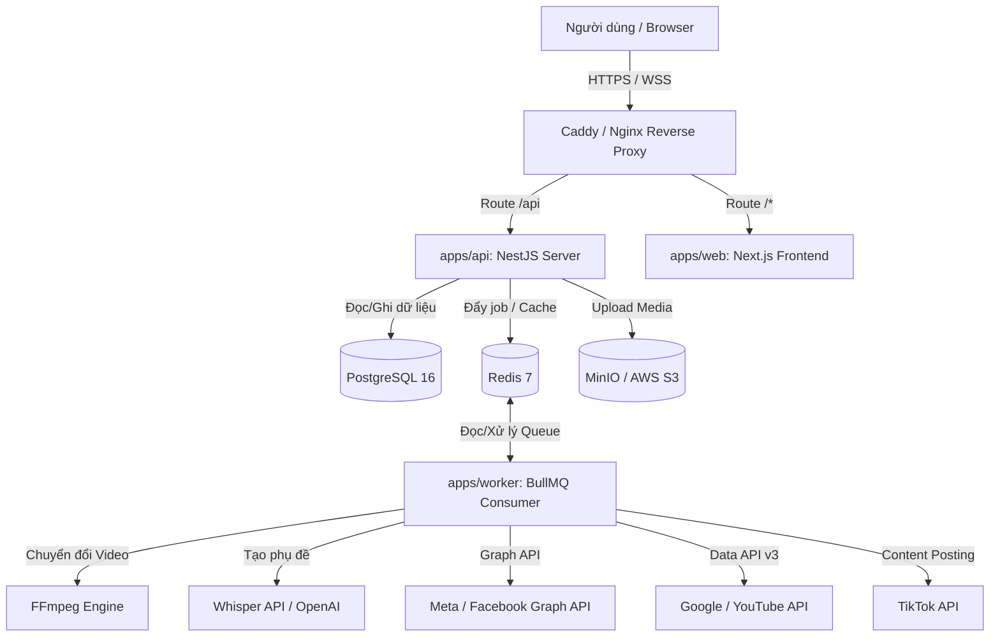
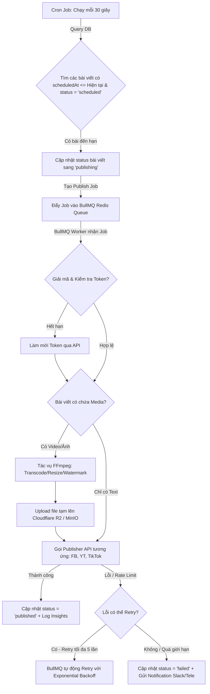

# Kiến Trúc Hệ Thống (Architecture Design) — Auto-Post Tool

Tài liệu này mô tả chi tiết các quyết định kiến trúc, sơ đồ luồng dữ liệu, và thiết kế kỹ thuật của hệ thống SaaS Tự Động Đăng Bài Đa Nền Tảng (Facebook, YouTube, TikTok).

---

## 🏛️ 1. Kiến trúc tổng thể (System Architecture)

Hệ thống được thiết kế theo mô hình **Monorepo** chia nhỏ thành các Service chạy trong các container Docker độc lập nhằm tối ưu hiệu năng tính toán và khả năng mở rộng.

### Chi tiết các thành phần:
1.  **apps/web (Next.js 14)**: Đóng vai trò là UI client. Giao diện được thiết kế với chuẩn thẩm mỹ tối tân (Glassmorphism, Dark mode), sử dụng TanStack Query để quản lý state API caching và Zustand cho global UI state.
2.  **apps/api (NestJS Server)**: Cung cấp API endpoints bảo mật cho client. Quản lý xác thực (JWT), định tuyến, đăng ký tài khoản mạng xã hội (OAuth 2.0), quản lý chiến dịch, và lập lịch đăng bài.
3.  **apps/worker (BullMQ NodeJS Worker)**: Môi trường chuyên dụng chạy các tác vụ nặng bất đồng bộ để tránh nghẽn CPU của API Server. Worker thực hiện transcode video qua FFmpeg, burn-in subtitle và tiến hành upload chunk-by-chunk lên Facebook, YouTube, TikTok.
4.  **MinIO (Local S3-compatible)**: Cung cấp API giống hệt AWS S3/Cloudflare R2 tại môi trường local giúp lưu trữ tạm thời các file hình ảnh/video của người dùng tải lên trước khi đăng tải.

---

## 🔒 2. Quy trình xác thực OAuth 2.0 & Bảo mật Token

Bảo mật token liên kết tài khoản của người dùng là yếu tố sống còn. Chúng tôi áp dụng quy trình mã hóa **AES-256-GCM** cho toàn bộ Access Token và Refresh Token trước khi lưu xuống PostgreSQL.

```mermaid
sequenceDiagram
    autonumber
    actor User as Người Dùng
    participant Web as Next.js Frontend
    participant API as NestJS API
    participant DB as PostgreSQL
    participant Social as Facebook/YouTube/TikTok API

    User->>Web: Nhấp "Liên kết tài khoản"
    Web->>API: Yêu cầu OAuth URL (state + redirect_uri)
    API-->>Web: Trả về OAuth Authorization URL
    Web->>Social: Chuyển hướng tới trang xác thực mạng xã hội
    User->>Social: Đồng ý cấp quyền cho Ứng dụng
    Social-->>Web: Redirect về callback với authorization code
    Web->>API: Gửi authorization code
    API->>Social: Request Exchange Token (Client Secret + Code)
    Social-->>API: Trả về Access Token + Refresh Token
    rect rgb(30, 41, 59)
        Note over API: Mã hóa token sử dụng AES-256-GCM<br/>và ENCRYPTION_KEY từ file env
    end
    API->>DB: Lưu thông tin SocialAccount (Đã mã hóa token)
    API-->>Web: Trả về kết quả Liên kết thành công
    Web-->>User: Hiển thị trạng thái "Đã kết nối"
```

### Cơ chế tự động làm mới Token (Refresh Token Background Job):
Mỗi mạng xã hội cấp Access Token có thời hạn (ví dụ: Meta 60 ngày, Google 1 giờ, TikTok 24 giờ).
- Hệ thống sẽ chạy một scheduler định kỳ kiểm tra các token sắp hết hạn (trong vòng 15-30 phút tới).
- Worker sẽ giải mã Refresh Token bằng key `AES-256-GCM`, gọi API làm mới của nền tảng, sau đó mã hóa Access Token mới và cập nhật lại Database.

---

## 📅 3. Quy trình Lập lịch & Xử lý Hàng đợi (Queue & Scheduler Flow)

Hệ thống lập lịch sử dụng mô hình kết hợp giữa **Quét định kỳ (DB Cron Quét mỗi 30s)** và **Hệ thống hàng đợi đẩy (BullMQ + Redis)** để đảm bảo bài viết được đăng đúng giờ và không bị bỏ lỡ kể cả khi hệ thống chịu tải cao.

### Ưu điểm vượt trội của BullMQ:
- **Exponential Backoff**: Khi API của Facebook/TikTok bị rate limit hoặc quá tải, BullMQ sẽ tự động thử lại sau 1s, 2s, 4s, 8s, 16s... giảm áp lực tối đa lên API đối tác.
- **Concurrency Control**: Chúng tôi giới hạn số lượng bài đăng đồng thời trên mỗi Social Account để tránh bị thuật toán của các mạng xã hội đánh dấu spam (Rate limiting rules).

---

## 🎬 4. Pipeline Xử lý Video & Resumable Upload (TUS)

Khi người dùng upload các file video lớn lên hệ thống (đặc biệt là video dài cho YouTube hoặc Full HD TikTok):
1.  **Resumable Upload (TUS Protocol)**: Client tải video lên MinIO/R2 theo từng chunk. Nếu mạng bị ngắt quãng, client có thể tiếp tục upload từ chunk bị lỗi mà không cần tải lại từ đầu.
2.  **FFmpeg Pipeline**:
    *   **Transcoding**: Tự động chuyển đổi các định dạng lạ về chuẩn `MP4 (H.264 video codec, AAC audio codec)` để đảm bảo 100% hiển thị tốt trên mọi nền tảng.
    *   **Watermarking**: Đóng dấu bản quyền logo thương hiệu của khách hàng lên vị trí chỉ định.
    *   **Subtitling**: Sử dụng Whisper API để chuyển đổi giọng nói trong video thành file text phụ đề, sau đó burn-in trực tiếp vào video (Hard subtitles) hoặc xuất file `.srt` (Soft subtitles) đính kèm.
